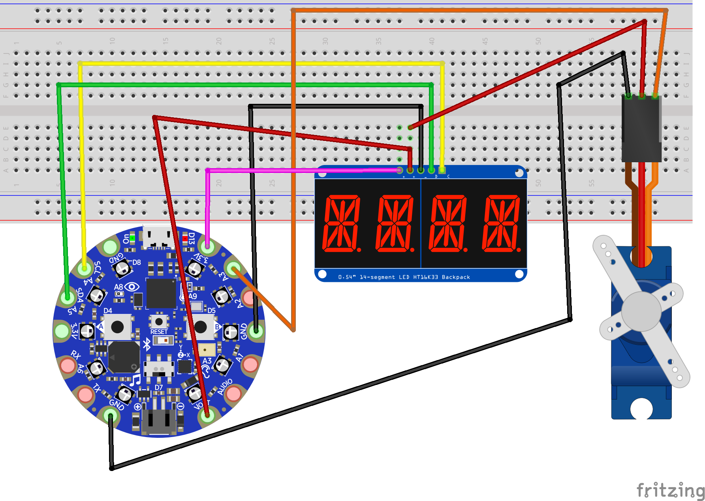
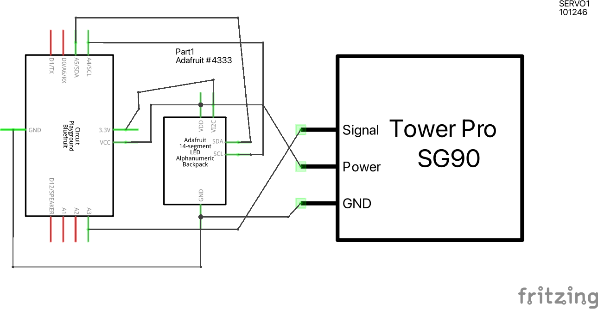

BritBot 3000
============

A web-connected, websockets-driven robotic indicator for raising
ones hands and getting attention during Zoom calls.

Requires:

- CircuitPlayground Express or Bluefruit
  (could be easily adapted to any CircuitPython-capable microcontroller)
- Server to run websocket echo server
- Driver running on Internet-connected client computer connected via
  serial to the microcontroller.

- `SG90 or similar servo <http://www.ee.ic.ac.uk/pcheung/teaching/DE1_EE/stores/sg90_datasheet.pdf>`_
- `14-segment alphanumeric display w/HT16K33 controller <https://www.adafruit.com/product/1911>`_

Author: Joel Burton <joel@joelburton.com>

